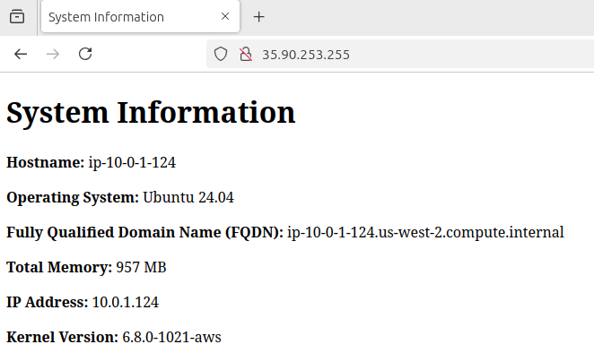

# 4640-w7-lab-start-w25

## General Setup
1. **Clone the repository** to your local machine.
2. **Ensure you have the following installed and setup**:
    - Install [Terraform](https://developer.hashicorp.com/terraform/tutorials/aws-get-started/install-cli).
    - Connect to AWS derver with `aws configure` with your Access Key ID and Secret Access Key. 

## STEPS
1. **Generate a new SSH key pair**
    ```bash
    ssh-keygen -t ed25519 -f ~/.ssh/aws
    ```
2. **Import the key to AWS**
    - Open project repo
    - Run
    ```bash
    ./scripts/import_lab_key $HOME/.ssh/aws.pub
    ```
3. **Run Terraform**
    ```bash
    cd terraform
    terraform init
    terraform apply --auto-approve
    cd ..
    ```
4. **Complete host.yml**
    - server-one: {`<first-ip-addres-or-dns>`}
    - server-two: {`<second-ip-addres-or-dns>`}
5. **Complete playbook.yml**
    - see `./ansible/playbook.yml`
    - note `become: true` is needed elevate privilege like sudo.
6. **Run Ansible command**
    ```bash
    ansible-playbook -i ./inventory/hosts.yml playbook.yml
    ```
## Screenshot


## Clean up
1. **Terminate instances**
    ```bash
    cd terraform
    terraform destroy --auto-approve
    cd ..
    ```
2. **Delete SSH Key**
    ```bash
    ./scripts/delete_lab_key
    rm $HOME/.ssh/aws
    rm $HOME/.ssh/aws.pub
    ```